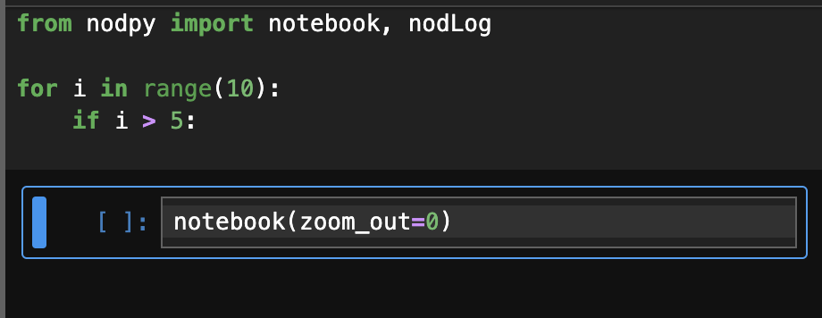
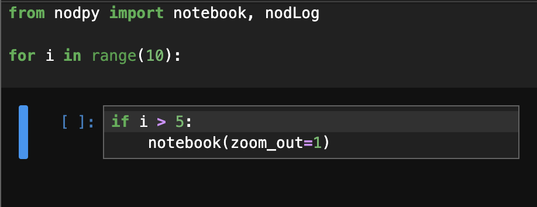

# NOD: Notebooks-On-Demand

### Put a Notebook Anywhere

Nod is a JupyterLab extension for inserting a notebook anywhere in a running Python program, allowing you to write and debug your program while interacting with its state. Nod is like a breakpoint with a notebook inside. From anywhere in your program, just add `notebook()` and run it. When the program execution reaches `notebook()`, the program will pause, and a JupyterLab session will start with the variables available at that line. The code within the function that calls `notebook()` will be converted to a notebook and will open automatically. Make edits, rerun code, inspect the output, and at the end, you can send your changes back to your source file with a button at the top of the notebook.

- [Usage](#usage)
  - [`zoom_out`](#zoom_out)
  - [NodLog](#nodlog)
  - [Nod Config](#nodconfig)
  - [`--existing` (for JupyterHub users)](#--existing-for-jupyterhub-users)
  - [How do I recover files if I forget to send my changes back to the source, or Jupyter crashes?](#how-do-i-recover-files-if-i-forget-to-send-my-changes-back-to-the-source-or-jupyter-crashes)
- [JupyterHub Installation](#jupyterhub-installation)
- [Running Nod as a VSCode Task](#running-nod-as-a-vscode-task)

#### To Get Started:

1. `pip install jupyter` if you don't have Jupyter already installed.
2. `pip install --user nodpy && nod --install-kernel`
3. Call the `notebook()` function somewhere in your program. (See [Usage](#usage) for an example).
4. Run your python program with `nod <command to execute your python script>`

## Participate in Research!

Interested in using Nod? Try it out for 3-6 weeks and chat with me about it! Participants recieve a gift card of \$50-\$100 (depending on how much time we chat for). All the details are in the [Sign Up Form](https://forms.gle/mDhWRuZwCBkG9TdE8).

My name is Eric Rawn. I'm a PhD Student at UC Berkeley. To build the best system I can (and do some research along the way), I want to see how folks are using Nod in their own work, and I'd really love your insight! If you decide to participate, the extension will log some usage data locally on your machine, which you'll send to me manually at the end of the study. We'll have a few conversations about your experience with the extension and the kind of work you do.

If you have any questions at all, send me an email at erawn@berkeley.edu, and feel free to send this page to anyone you think might be interested! Thanks so much!

## Usage

In a Python file call `notebook()` anywhere:

```python
#myfile.py
from nodpy import notebook

def f():
    x = 1
    notebook()
f()
```

then run the python program with `nod <command>`:

```bash
nod python -m myfile
```

and you'll see a Jupyter editor with the current state of your program when you called `notebook()`:
<p align="center">
  
</p>

Notice above that we haven't executed `x = 1` yet, but `x` is in our kernel state, because we had defined it before we called `notebook()`. Any variable you would be able to reference in your Python program at the `notebook()` call will be available in your Jupyter session.

Nod converts everything in the _current function body_ to edit. By default, empty lines are converted to cell breaks, and markdown cells are converted to comments (e.g. ##, ###).

The left panel navigates up and down your callstack---your notebook state will switch automatically to the variables at that place in the program. You'll notice three buttons at the top of the left panel:

-  Sends any text changes made in the notebook back to your source files. By default, the notebook is converted to [light](https://jupytext.org/formats/scripts) format \(see [Config](#nodconfig) for more options.\)
-  Restarts your original python program by re-executing the `<command>` from your `nod <command>` command line invocation, and updates the Jupyter editor to match. If you want to make changes directly to your source file and pull them to your Nod Jupyter session, just press "Restart without Saving" at the prompt when you restart.
-  Quits the current Nod kernel. By default, your python program will continue to run from `notebook()` until it exits itself. If you would like to signal the program instead, see [how_exit](#nodconfig).

### `zoom_out`

To focus your Notebook-on-demand on a specific part of your code, call `notebook()` with the `zoom_out` parameter, set to the number of indent levels to capture. For example, this program opens an editable notebook just on the body of the `if` statement:

```python
from nodpy import notebook
for i in range(10):
  if i > 5:
    notebook(zoom_out=0)
```

<p align="center">
    
</p>

while this program opens the body of the `for` loop:

```python
from nodpy import notebook
for i in range(10):
  if i > 5:
    notebook(zoom_out=1)
```

<p align="center">
    
</p>

### NodLog

To save values to put into the Notebook state later, call `nodLog(var,var,...)`:

```python
from nodpy import notebook, nodLog
def f():
    for i in range(10):
        nodLog(i)
    notebook()
f()
```

and you'll see a list in your Nod Session appear on the `Nod Log` panel on the right:
<p align="center">
  
</p>

Click the  button to put that value into the notebook state.

_Variables passed to NodLog must be able to [deepcopy](https://docs.python.org/3/library/copy.html#copy.deepcopy)_

### NodConfig

To configure module-level settings for Nod, call `nodConfig()` at the entry point for your Python program. Options are:

- **filter**: (default ['\<CWD\>/**'])
  list of paths (as strings) to include in the trace filter. Accepts \*, ?, and [] as wildcards

- **fmt**: (default 'light')
  notebook conversion format.
  Options: "light", "percent"

- **how_exit**: (default 'continue')
  how the Nod session should be exited from the notebook.
  "continue" returns to let the program finish, and "exit" will stop the program.
  Options: 'continue', 'exit'

- **dangerously_bypass_readonly**: (default 'false')
  Once the code in associated with one stack frame in a Nod Session is edited, the others become read-only by default to prevent reaching a confusing state. Set to true to remove this safeguard, if you know what you're doing.

### `--existing` (for JupyterHub users)

**Important**: JupyterHub users will need to manually place a config file to activate the extension. See the [JupyterHub Installation Tutorial](#jupyterhub-installation) below

JupyterHub users (and anyone else who doesn't want a new Jupyter window to spawn for every Nod session) can use `-e` or `-existing` in their `nod` call:
`nod -e python -m module`
and the session will appear in the left panel under "Sessions":

<p align="center">
    
</p>

Press "Connect" to open the session in Jupyterlab.

JupyterLab can't open files located outside of its home directory or any subdirectories, so make sure you call `nod -e <cmd>` in a directory you can see in the JupyterLab file navigator.

### How do I recover files if I forget to send my changes back to the source, or Jupyter crashes?

In the directory you call `nod <cmd>` in, a `./nod/` folder will be created to store the current notebooks (`/nod/connection/`) and previous ones (`/nod/archive/`), so you should be able to recover any notebooks in there (including notebook checkpoints), as long as they were saved (you pressed `CTRL+S` in Jupyterlab).

## JupyterHub Installation

Run `jupyter server extension list` in a terminal in JupyterHub. If you don't see `nodpy`, you'll need to manually place a json file named `nodpy.json` with this content:

```
{
  "ServerApp": {
    "jpserver_extensions": {
      "nodpy": true
    }
  }
}
```

inside of your jupyter config directory.

To find this path, run `jupyter --config-dir`. You should see a path which ends in a `.jupyter` folder (if you don't, run `jupyter --paths` and find the config folder which ends in `.jupyter`).

Inside that `.jupyter` config folder, make a new folder called `jupyter_server_config.d` if one doesn't exist, and place the `nodpy.json` file in there. The final path should look like `<user>/.jupyter/jupyter_server_config.d/nodpy.json`.

Run `jupyter server extension list` again and you should see nodpy in the list now.

Now restart your Jupyter Server. You can usually do this by going to `File` -> `Hub Control Panel` and pressing `Stop My Server`, then `Start My Server`.

This is still a work in progress. Please make an issue if you are trying to get Nod working in a JupyterHub enviornment and I'll do my best to help.

## Running Nod as a VSCode Task

To execute Nod without going to the command line each time, add Nod as a VSCode task. If you don't already have a `.vscode/tasks.json` file in your directory, create it with this content:

```
{
    // See https://go.microsoft.com/fwlink/?LinkId=733558
    // for the documentation about the tasks.json format
    "version": "2.0.0",
    "tasks": [
        {
            "label": "Nod",
            "type": "shell",
            "command": "<ACTIVATE VIRTUAL ENV IF USING> && nod <CMD TO RUN PYTHON FILE>",
            "presentation": {
                "reveal": "always",
                "panel": "new",
                "echo": true,
            },
        }
    ]
}
```

Where `<ACTIVATE VIRTUAL ENV IF USING>` is the command to activate your virtual enviornment (e.g. `source venv/bin/activate`) and `<CMD TO RUN PYTHON FILE>` is how you run your Python file (e.g. `python -m myfile1`).

Now execute the task by selecting `Run Task` from the pallette `CTRL+SHIFT+P` and selecting `Nod`.
